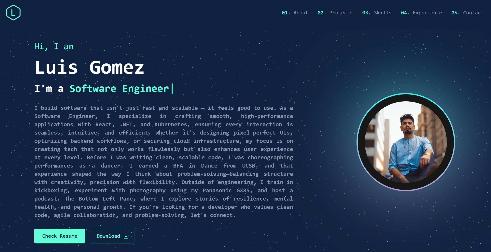

# Personal Portfolio Website

A modern, responsive portfolio website built with React and TypeScript. This application showcases my professional work, skills, and experience in an interactive and visually appealing way.

[](https://reactjs.org/)
[](https://www.typescriptlang.org/)
[](https://tailwindcss.com/)

## 🌟 Live Demo

[View Live Demo](https://portfolio-5bdb9.web.app/) <!-- Replace with your actual deployed URL -->

## 📸 Screenshots

### Home Page


## ✨ Features

### 🎨 Modern Design & UX
- Responsive layout that adapts to all screen sizes
- Dark/Light mode with smooth transitions
- Interactive UI elements with hover effects
- Custom scrollbar and smooth scrolling

### 🚀 Performance & Technical
- Optimized bundle size for fast loading
- Lazy-loaded components for better performance
- SEO-friendly with meta tags
- Progressive Web App (PWA) capabilities

### 🛠️ Functionality
- Interactive project showcase with filtering
- PDF viewer for downloadable documents
- Animated skill cloud visualization
- Contact form with Firebase integration
- Blog section with markdown support

### 🎯 User Experience
- Smooth page transitions
- Loading states and animations
- Error boundaries for graceful failure handling
- Accessible design following WCAG guidelines

## 🛠️ Technologies Used

### Frontend
- **Framework:** React 18 with TypeScript
- **Styling:** 
  - Tailwind CSS for utility-first styling
  - Mantine UI Components for consistent design
  - Emotion for dynamic styling
- **Animations & Effects:**
  - AOS (Animate On Scroll) for scroll animations
  - Vanta.js for interactive background effects
  - Typewriter Effect for dynamic text
- **State Management & Forms:** Mantine Hooks & Form
- **Icons:** Tabler Icons, Lucide React

### Backend & Storage
- Firebase for authentication and data storage
- React-PDF for document handling

### Development Tools
- CRACO for custom webpack configuration
- TypeScript for type safety
- ESLint for code quality
- Git for version control

## 🚀 Why This Stack?

This portfolio was built with modern web technologies chosen for their:
- **Performance:** React 18's concurrent features and optimized rendering
- **Type Safety:** TypeScript for better development experience and fewer runtime errors
- **Styling:** Tailwind CSS + Mantine for rapid development and consistent design
- **Scalability:** Firebase for easy backend integration and future expansion
- **Developer Experience:** Modern tooling for efficient development workflow

## 🏗️ Project Structure

```
my-portfolio/
├── src/
│   ├── components/     # Reusable UI components
│   ├── pages/         # Page components
│   ├── styles/        # Global styles and Tailwind config
│   ├── utils/         # Utility functions
│   └── App.tsx        # Main application component
├── public/            # Static assets
└── package.json       # Project dependencies and scripts
```

## 🚀 Getting Started

### Prerequisites

- Node.js (v14 or higher)
- npm or yarn

### Installation

1. Clone the repository:
```bash
git clone [your-repository-url]
```

2. Install dependencies:
```bash
npm install
# or
yarn install
```

3. Start the development server:
```bash
npm start
# or
yarn start
```

The application will open in your default browser at `http://localhost:3000`.

## 📝 Available Scripts

- `npm start` - Runs the app in development mode
- `npm test` - Launches the test runner
- `npm run build` - Builds the app for production
- `npm run eject` - Ejects from Create React App (one-way operation)

## 🤝 Contributing

Contributions are welcome! Please feel free to submit a Pull Request.

## 📄 License

This project is licensed under the MIT License - see the [LICENSE](LICENSE) file for details.

## 📧 Contact

- Portfolio: [https://portfolio-5bdb9.web.app/]
- LinkedIn: [www.linkedin.com/in/luis-gomez-g714]
- Email: [lgomez00714@gmail.com](mailto:lgomez00714@gmail.com)
- GitHub: [https://github.com/gomez714]

---
Made with ❤️ by Luis Gomez
